# Hi, I'm Ali Akbar 👋

Software Engineer | C++ · Java · Python · GraalVM · Apache Flink

### 🔗 Connect with me

  
  

### 🛠️ Tech Stack

  
  
  
  
  
  
  

  
  
  

### 📊 GitHub Stats

  
  

### 🔥 Streak Stats

  

### 🏆 GitHub Trophies

  

### 📈 Contribution Graph

  <picture>
    <source media="(prefers-color-scheme: dark)" srcset="https://raw.githubusercontent.com/AliAkbarBaloch/AliAkbarBaloch/output/github-contribution-grid-snake-dark.svg" />
    <source media="(prefers-color-scheme: light)" srcset="https://raw.githubusercontent.com/AliAkbarBaloch/AliAkbarBaloch/output/github-contribution-grid-snake.svg" />
    
  </picture>

  

<!-- Visitor counter -->

  

